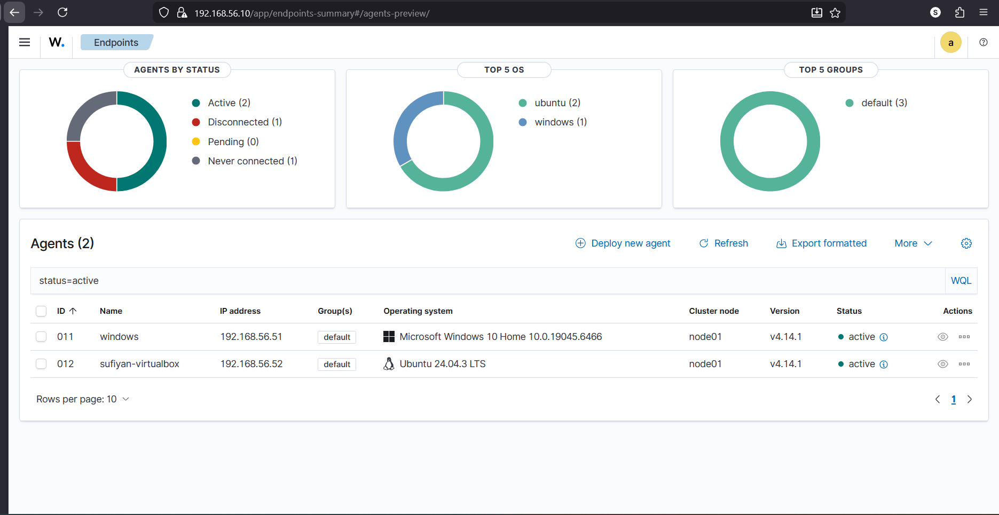

# WAZUH - REPORT INSTALLATION & DASHBOARDS

## EXECUTIVE SUMMARY

This document captures only the installation steps, verification checks, and dashboard/monitoring guidance for a hands-on Wazuh deployment used in a lab with the following topology:
    - Wazuh Manager & Server: ubuntu VM (lightweight host)
    - Victim / Monitored host: Windows 10 (Wazuh Agent)
    - Lubuntu VM (Ubuntu Agent)
    - Attacker: Kali Linux (used to generate test activity)
    - Dashboard / GUI: Wazuh Dashboard on Windows 11 host
    - Firewall: Pfsense
The goal is to provide a concise, actionable reference for installing Wazuh components, validating connectivity, and creating dashboard panels for useful SOC views.

## LAB ENVIRONMENT & ARCHITECTURE

```
┌──────────────────────────────────────────────────────────────────┐
│                       VirtualBox Host                             │
│                                                                  │
│  ┌──────────────────────── WAN (NAT) ─────────────────────────┐ │
│  │                                                             │ │
│  │                    [ Internet ]                             │ │
│  │                                                             │ │
│  └───────────────▲─────────────────────────────────────────────┘ │
│                  │                                                 │
│          ┌───────┴────────┐                                        │
│          │   pfSense       │                                        │
│          │ Firewall/Router │                                        │
│          │ WAN: NAT        │                                        │
│          │ LAN: Host-Only  │                                        │
│          │ 192.168.56.1    │                                        │
│          └───────┬────────┘                                        │
│                  │  Syslog (UDP 514)                                │
│                  ▼                                                  │
│  ┌────────────────────────────────────────────────────────────┐   │
│  │                    Wazuh Server                              │   │
│  │                192.168.56.10                                  │   │
│  │                                                            │   │
│  │  ┌─────────────┐   ┌─────────────┐   ┌─────────────────┐ │   │
│  │  │ Wazuh       │   │ Wazuh       │   │ Wazuh Dashboard │ │   │
│  │  │ Manager     │   │ Indexer     │   │ (OpenSearch UI) │ │   │
│  │  │ (1514/TCP)  │   │ (9200/TCP)  │   │ (5601/TCP)      │ │   │
│  │  └─────────────┘   └─────────────┘   └─────────────────┘ │   │
│  │                                                            │   │
│  │  Raw logs: /var/ossec/logs/archives/archives.json           │   │
│  │  Alerts:  /var/ossec/logs/alerts/alerts.json                │   │
│  └───────────────┬───────────────────────┬───────────────────┘   │
│                  │                       │                         │
│        Agent (1514/TCP)         Agent (1514/TCP)                   │
│                  │                       │                         │
│        ┌─────────▼────────┐   ┌──────────▼─────────┐              │
│        │   Windows 10     │   │   Ubuntu Linux     │              │
│        │   Wazuh Agent    │   │   Wazuh Agent      │              │
│        │ Auth / Proc logs │   │ Syslog / AppArmor  │              │
│        └─────────┬────────┘   └──────────┬─────────┘              │
│                  │                       │                         │
│                  └───────────────┬───────┘                         │
│                                  │                                 │
│                         ┌────────▼────────┐                        │
│                         │   Kali Linux     │                        │
│                         │   Attacker       │                        │
│                         │ Scans / Brute    │                        │
│                         └─────────────────┘                        │
│                                                                  │
└──────────────────────────────────────────────────────────────────┘

```

## PREREQUISITES

Ubuntu Desktop
Sudo or root privileges
Stable internet connection
At least 4 GB of RAM and 15 GB of free disk space

## CORE WAZUH ARCHITECTURE 

Before beginning the installation, it is essential to understand the three core components of Wazuh and how they interact within the security ecosystem:

### Wazuh Server (Manager):

Serves as the central engine of Wazuh. It collects and analyzes data from the Wazuh agents, applies detection rules, and generates alerts. All processed alerts are then stored in the Wazuh Indexer.

### Wazuh Indexer:

A customized version of OpenSearch designed to store and index security data efficiently. It enables fast search, querying, and reporting of alerts and logs.

### Wazuh Dashboard:

A user-friendly, web-based graphical interface used to visualize security data, manage agents, and configure Wazuh settings.

## HOW THE COMPONENTS WORK TOGETHER

**Wazuh Agents** (deployed on endpoints) continuously send logs and security events to the **Wazuh Server**.
The Server analyzes the incoming data, applies rules, and stores results in the **Wazuh Indexer**.
The **Dashboard** then queries the Indexer and presents the processed information in an intuitive, visual format.

## WAZUH INSTALLATION PROCEDURE

Follow the steps below to install Wazuh using the official automated script:
    **Switch to the root user**: sudo -i
    **Install CURL**: apt install curl -y
    **Install Java JDK (required for the Wazuh Indexer)**: apt install default-jdk -y
    **Download the Wazuh installation script**: curl -sO 		https://packages.wazuh.com/4.12/wazuh-install.sh
    **Run the installation script in all-in-one mode**: bash wazuh-install.sh -a

## POST-INSTALLATION OVERVIEW

After the installation completes, the script provides key details required to access and manage Wazuh:

**Backup folder location** for configuration files.
**Default credentials** (username and password) for the Wazuh Dashboard.
**Dashboard access URL** — <your_server_ip> with the actual server IP:
	
 ``` 192.168.56.x ```
 
Use the provided **admin credentials** to log in to the Wazuh Dashboard and begin monitoring.

## VISUAL WALKTHROUGH OF WAZUH


	
- WAZUH MANAGER


- WINDOWS AGENT


- LINUX AGENT



- WAZUH DASHBOARD
## CONCLUSION & NEXT STEPS
By following this guide, you have successfully deployed the **Wazuh Server** (Manager), **Wazuh Indexer**, and **Wazuh Dashboard** on your Ubuntu environment using the automated installation script. With the setup completed, you now have a centralized platform capable of collecting, analyzing, and visualizing security events in real time.

This deployment establishes the foundation for a **Security Operations Center (SOC)-style monitoring setup**, where endpoints can be integrated as agents, and alerts can be fine-tuned to align with organizational security requirements. From here, you can:
    Begin **onboarding additional agents** from Windows, Linux, or cloud workloads.
    **Customize detection rules** to suit your threat landscape.
    Leverage **File Integrity Monitoring (FIM)**, **log collection**, and **intrusion detection** features for deeper visibility.
    Build **dashboards and visualizations** tailored to your monitoring and compliance needs.

With Wazuh in place, you are equipped to move beyond installation into **proactive monitoring, incident detection, and response**, enhancing the overall security posture of your environment.
